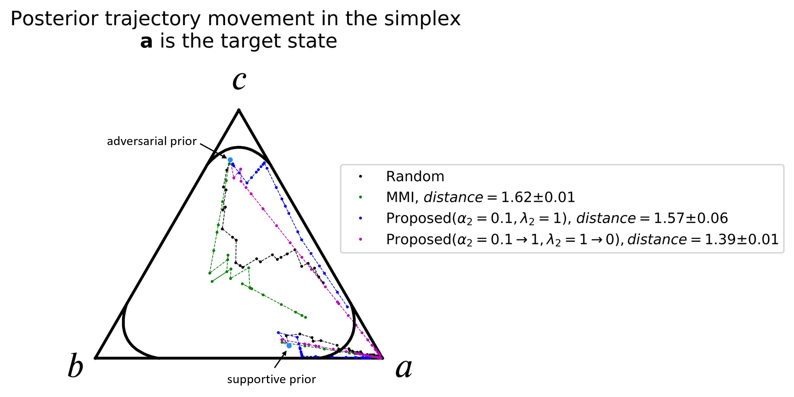

# Active recursive Bayesian inference using R ́enyi information measures

  
This repo contains an implementation of active RBI method, "https://arxiv.org/pdf/2004.03139.pdf", a unified approach using R ́enyi information measures that provides high accuracy and speed in the sequential estimation process by encouraging exploration, particularly in the adversarial cases. 

  ## Dependecy
  python=3.5
